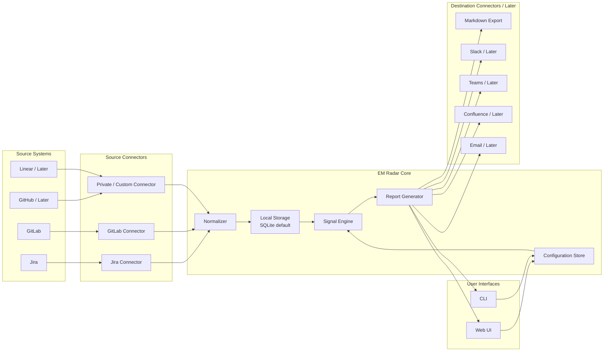
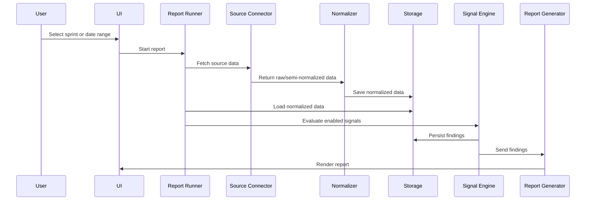
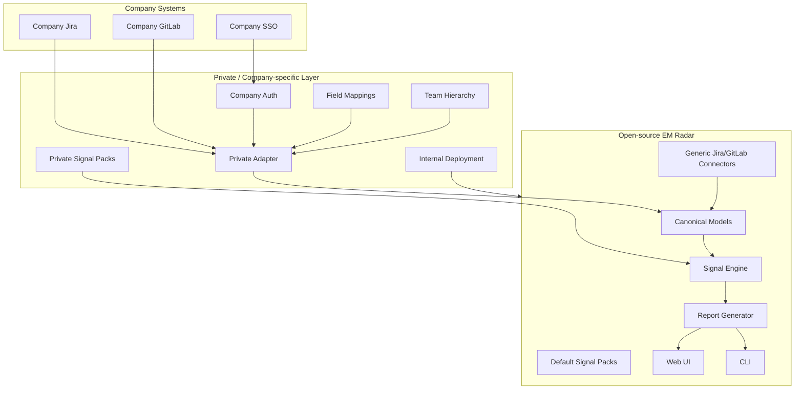
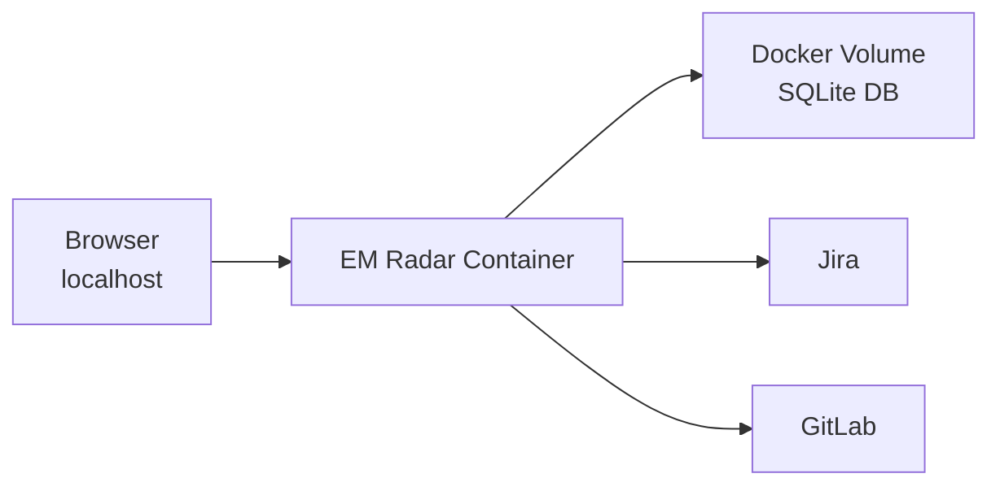
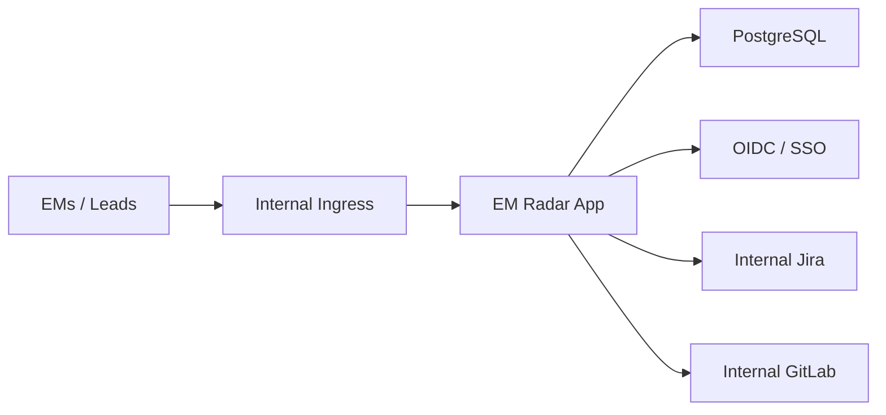
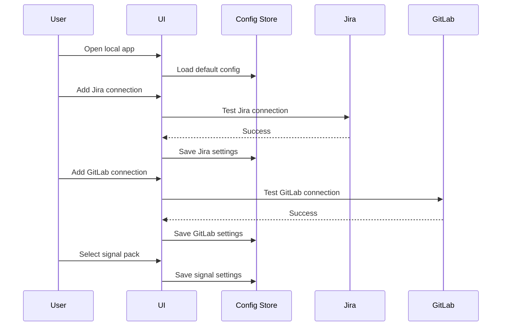
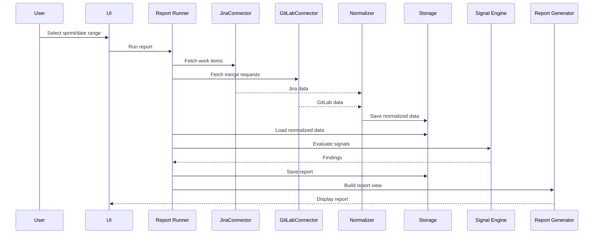

# EM Radar — Architecture Overview

## 1. Purpose

This document describes the high-level architecture of **EM Radar**.

EM Radar is a local-first engineering management signal engine. It connects to source systems such as Jira and GitLab, normalizes their data, stores it locally, evaluates configurable signals, and produces actionable reports through a UI and CLI.

The architecture is designed around four core goals:

1. Keep the signal engine source-agnostic.
2. Keep user and company data local by default.
3. Allow connectors and adapters to be swapped or extended.
4. Clearly separate open-source components from private/company-specific components.

---

## 2. High-level Architecture



---

## 3. Architecture Principles

### 3.1 Core is source-agnostic

The signal engine must not know whether data came from Jira, GitLab, GitHub, Linear, CSV, or a private company adapter.

The engine evaluates normalized internal models only.

Correct:

```text
Jira issue → Jira connector → Normalizer → WorkItem → Signal Engine
```

Incorrect:

```text
Signal Engine → Jira API
```

---

### 3.2 Local-first by default

The default deployment model is local.

For MVP:

```text
Docker container
Local browser UI
SQLite database in local Docker volume
Personal access tokens stored locally
Reports stored locally
No telemetry by default
```

The user should be able to run EM Radar without a cloud account, company-wide installation, Kubernetes, SSO, or enterprise approval.

---

### 3.3 Open core, private adapters

The open-source project should contain the generic engine, common connectors, data model, UI, report generation, and default signal packs.

Company-specific code and configuration should live outside the open-source core.

This allows companies to keep sensitive implementation details private while still using the open-source core.

---

### 3.4 Rules-first, AI-optional

The MVP signal engine is deterministic and does not require an LLM.

AI-based analysis may be added later through an optional AI connector, but AI must not be part of the core runtime path.

---

## 4. Layer Overview

The system is organized into the following layers:

```text
Source Systems
    ↓
Source Connectors
    ↓
Normalizer
    ↓
Storage
    ↓
Signal Engine
    ↓
Report Generator
    ↓
UI / CLI / Exports
```

Each layer has a clear responsibility.

---

## 5. Source Systems

Source systems are external tools used by engineering teams.

MVP source systems:

* Jira
* GitLab

Later source systems:

* GitHub
* Linear
* Azure DevOps
* Bitbucket
* Shortcut
* CSV/JSON imports

Source systems are not accessed directly by the signal engine. They are accessed through connectors.

---

## 6. Source Connectors

Source connectors fetch data from external systems and prepare it for normalization.

MVP connectors:

* Jira Connector
* GitLab Connector
* Demo/Fake Connector

Later connectors:

* GitHub Connector
* Linear Connector
* Azure DevOps Connector
* Bitbucket Connector
* CSV/JSON Connector

Private/company connectors may also be implemented outside the open-source repository.

---

### 6.1 Connector Responsibilities

A source connector is responsible for:

* authenticating with the source system
* testing the connection
* listing available projects, boards, repositories, or groups
* fetching source data
* handling pagination and API limitations
* mapping obvious source fields
* passing raw or semi-normalized data to the normalizer
* avoiding token leakage in logs and errors

A source connector is not responsible for:

* evaluating signals
* deciding severity
* generating final reports
* storing long-term report results
* implementing company-specific management logic unless it is a private adapter

---

### 6.2 Jira Connector

The Jira connector fetches:

* projects
* boards
* sprints
* issues
* epics
* story/task/bug items
* issue relationships
* labels
* components
* assignee/reporter
* status and status category
* custom fields where configured

The Jira connector supports configurable mappings for fields such as:

* sprint
* parent/epic link
* story points
* acceptance criteria
* team
* blocked status or label

---

### 6.3 GitLab Connector

The GitLab connector fetches:

* groups
* projects
* merge requests
* reviewers
* approvers
* approval count
* pipeline status
* source and target branches
* changed files count
* additions and deletions
* merge/close timestamps

It also extracts work item keys from:

* merge request title
* merge request description
* source branch name

Example key pattern:

```regex
[A-Z]+-\d+
```

---

### 6.4 Private Connector / Adapter

A private connector or adapter is used when a company has custom systems, custom authentication, private field mappings, or internal policies.

Examples:

* company-specific Jira custom fields
* internal GitLab group conventions
* internal team hierarchy mapping
* private authentication mechanism
* internal data filtering/redaction
* company-specific deployment configuration

Private adapters should be kept outside the public open-source repository.

---

## 7. Normalizer

The normalizer converts source-specific data into EM Radar’s canonical data model.

This is the main boundary between messy external systems and the clean signal engine.

Example:

```text
Raw Jira issue
    ↓
Normalizer
    ↓
WorkItem
```

```text
Raw GitLab merge request
    ↓
Normalizer
    ↓
MergeRequest
```

---

### 7.1 Normalizer Responsibilities

The normalizer is responsible for:

* converting source-specific fields into canonical fields
* mapping source issue types to generic work item types
* mapping statuses to generic status categories
* extracting links between work items and merge requests
* applying configured field mappings
* preserving source URLs
* producing validation errors for unusable data

The normalizer is not responsible for:

* fetching data from APIs
* evaluating signals
* generating recommendations
* rendering reports

---

### 7.2 Canonical Models

The core canonical models are:

```text
WorkItem
Sprint
MergeRequest
Repository
TeamProfile
EvaluationWindow
SignalFinding
Report
```

These models are source-agnostic and are the only models the signal engine should evaluate.

---

## 8. Storage Layer

EM Radar stores data locally by default.

MVP storage:

```text
SQLite database
Stored in Docker volume
Default path: /data/em-radar.db
```

Later storage:

```text
PostgreSQL
For enterprise or multi-user deployment
```

---

### 8.1 Stored Data

The storage layer stores:

* source connection metadata
* selected projects/boards/repositories
* signal configuration
* field mappings
* normalized source data cache
* generated reports
* signal findings
* local user preferences

---

### 8.2 Credentials

Credentials require special handling.

MVP behavior:

* tokens are stored locally
* tokens are masked in UI
* tokens are never logged
* tokens are excluded from YAML exports
* documentation recommends read-only tokens where possible

Later improvements may include:

* encrypted local storage
* OS keychain integration
* Docker secrets support
* enterprise secret manager integration

---

### 8.3 Cache Strategy

Fetched data may be cached locally to improve report performance and support offline report viewing.

MVP cache behavior:

* previously generated reports are viewable offline
* cached source data can be manually refreshed
* cached source data can be deleted
* fresh reports require source connectivity unless cached generation is later supported

---

## 9. Configuration Store

The configuration store manages user-editable settings.

Configuration is stored in the local database, not only in YAML files.

This allows non-coding EMs to configure the system through the UI.

---

### 9.1 Configuration Types

Configuration includes:

* enabled/disabled signals
* signal thresholds
* severity overrides
* Jira field mappings
* GitLab key extraction pattern
* selected projects/boards/repositories
* team profiles
* report preferences

---

### 9.2 Default Configuration

On first startup:

1. EM Radar loads bundled default signal packs.
2. The defaults are seeded into the local database.
3. The user can modify settings through the UI.
4. Changes persist locally.

---

### 9.3 Import and Export

The system supports YAML import/export for signal configuration.

Rules:

* credentials must never be exported
* imported config must be schema-validated
* invalid config must be rejected with clear errors
* community configs must be declarative only
* config import must not execute arbitrary code

---

## 10. Signal Engine

The signal engine evaluates normalized data against configured signals.

It is the core of EM Radar.

---

### 10.1 Signal Engine Responsibilities

The signal engine is responsible for:

* loading enabled signals
* reading signal thresholds
* evaluating signals against canonical models
* producing findings
* assigning severity
* calculating confidence where applicable
* attaching evidence
* producing recommendations

The signal engine is not responsible for:

* fetching source data directly
* authenticating to Jira/GitLab
* rendering UI
* sending Slack/Teams messages
* calling LLM providers directly

---

### 10.2 Signal Evaluation Flow



---

### 10.3 MVP Signal Categories

MVP signal categories:

```text
Planning hygiene
Delivery flow
Sprint health
Merge request flow
Source-linking quality
```

Initial signals:

* stale in-progress work item
* blocked item without recent update
* story without acceptance criteria
* story without parent epic
* epic too broad
* epic without measurable description
* repeated carry-over
* sprint scope churn
* merge request waiting too long
* merge request without linked work item
* large merge request risk
* failing pipeline too long
* merged without enough approval

---

## 11. Report Generator

The report generator turns signal findings into user-readable output.

---

### 11.1 Report Responsibilities

The report generator is responsible for:

* grouping findings into sections
* summarizing top risks
* ordering findings by severity
* including evidence
* including recommendations
* linking back to source items
* exporting reports

---

### 11.2 MVP Report Sections

MVP reports include:

```text
Summary
Top risks
Planning hygiene
Delivery flow
Sprint health
Merge request flow
Source linking
Detailed findings
Suggested actions
```

The five signal categories (§10.3) map 1:1 to the five themed sections (planning hygiene,
delivery flow, sprint health, merge request flow, source linking); summary, top risks, detailed
findings, and suggested actions are cross-cutting.

---

### 11.3 Report Outputs

MVP outputs:

* UI report view
* Markdown export

Later outputs:

* JSON export
* PDF export
* Slack message
* Teams message
* email
* Confluence page

---

## 12. UI Layer

The UI is the primary interface for EMs.

It should be usable by an EM who is comfortable running Docker but does not actively code.

---

### 12.1 MVP UI Pages

MVP UI pages:

```text
Onboarding / Setup wizard
Dashboard
Source Connections
Teams
Signal Settings
Report Runner
Report Results
Settings / Privacy
```

The Setup page is an onboarding wizard that guides connection setup and team creation; the
Dashboard is the post-setup landing showing the latest report per team. See
[09-functional-flows](./09-functional-flows.md) for the end-to-end flows.

---

### 12.2 UI Responsibilities

The UI is responsible for:

* guiding first-time setup
* collecting Jira/GitLab connection settings
* testing source connections
* selecting projects/boards/repositories
* configuring signal thresholds
* running reports
* displaying findings
* exporting reports
* explaining privacy and local storage behavior

The UI is not responsible for:

* implementing signal logic
* directly calling Jira/GitLab
* storing credentials outside backend control
* executing custom rules

---

## 13. CLI Layer

The CLI is a secondary interface.

The CLI is useful for:

* local automation
* advanced users
* debugging
* future scheduled runs
* CI-like usage
* report generation from scripts

---

### 13.1 MVP CLI Scope

CLI is optional for MVP but should be considered in the architecture.

Possible MVP commands:

```bash
em-radar health
em-radar run --sprint "Sprint 42"
em-radar run --from 2026-05-01 --to 2026-05-15
em-radar export --report-id 123 --format markdown
em-radar config export
em-radar config import ./signal-pack.yml
```

If CLI is not implemented in MVP, the backend should still expose APIs that make CLI implementation straightforward later.

---

## 14. Destination Connectors

Destination connectors send reports or findings to external systems.

Destination connectors are not part of MVP.

Later destination connectors may include:

* Slack
* Microsoft Teams
* email
* Confluence
* Jira comments
* GitLab comments

Destination connectors must be explicit opt-in because they may send local findings or source data outside the local machine.

---

## 15. AI Connector

AI is not part of MVP.

Future AI functionality should be implemented through a connector/provider interface.

Potential AI providers:

* Claude
* OpenAI
* local Ollama
* Gemini
* company-hosted LLM gateway

---

### 15.1 AI Boundary

The signal engine may request an AI-assisted evaluation through an interface, but it must not depend on a specific provider.

Correct:

```text
Signal Engine → AI Provider Interface → Claude Connector
```

Incorrect:

```text
Signal Engine → Claude API directly
```

---

### 15.2 AI Use Cases

Potential future AI use cases:

* Definition of Ready checks
* vague ticket detection
* weak acceptance criteria detection
* epic split suggestions
* report summarization
* suggested actions

AI must be disabled by default.

The UI must clearly explain what data may be sent to the configured AI provider.

---

## 16. Open-source and Private Split

EM Radar should be designed so the core project can remain open source while company-specific implementation details remain private.

---

### 16.1 Open-source Components

The open-source repository should contain:

```text
Core signal engine
Canonical data model
Normalizer framework
Configuration store
Default signal packs
Generic Jira connector
Generic GitLab connector
Demo/fake connector
Report generator
Web UI
CLI, when implemented
Docker Compose setup
Documentation
Tests
```

---

### 16.2 Private / Company-specific Components

Private repositories or local-only configuration may contain:

```text
Company-specific Jira field mappings
Company-specific GitLab group mappings
Company-specific team hierarchy
Company-specific authentication
Internal deployment configuration
Private signal packs
Private source connectors
Private destination connectors
Private AI gateway connectors
Internal policy/redaction rules
```

---

### 16.3 Open/private Boundary Diagram



---

## 17. Deployment Architecture

### 17.1 MVP Local Deployment

MVP deployment is local and simple.



Expected local command:

```bash
docker compose up
```

The application should expose a local URL such as:

```text
http://localhost:8080
```

---

### 17.2 Later Enterprise Deployment

Enterprise deployment is later-stage.

Possible enterprise architecture:



Enterprise capabilities may include:

* PostgreSQL
* OIDC/SSO
* RBAC
* audit logs
* private config registry
* Helm chart
* centrally managed connectors

These are not part of MVP.

---

## 18. Runtime Flow

### 18.1 First-time Setup Flow



---

### 18.2 Report Generation Flow



---

## 19. Suggested Repository Structure

```text
em-radar/
  apps/
    api/
      src/
        em_radar_api/
      tests/

    web/
      src/
      tests/

    cli/
      src/
      tests/

  packages/
    core/
      src/
        em_radar_core/
          models/
          signals/
          evaluation/
          scoring/
      tests/

    connectors/
      jira/
      gitlab/
      demo/
      tests/

    normalizer/
      src/
      tests/

    reports/
      src/
      tests/

    config/
      defaults/
      schemas/
      tests/

  docs/
    vision-and-scope.md
    requirements.md
    architecture-overview.md
    data-model.md
    connectors.md
    signal-packs.md
    privacy.md

  examples/
    fake-company/
      demo-data/
      signal-packs/

  deploy/
    docker/
      Dockerfile
      docker-compose.yml

  README.md
  LICENSE
```

---

## 20. Technology Choices

Recommended MVP stack:

```text
Backend:
  Python + FastAPI

Frontend:
  React + Vite

Storage:
  SQLite default

ORM:
  SQLAlchemy + Alembic

Reports:
  Markdown first

Deployment:
  Docker Compose

Configuration:
  Database-backed with YAML import/export

Testing:
  Pytest for backend/core
  Frontend tests later as needed
```

PostgreSQL, Helm, OIDC, and scheduled jobs can be added later.

---

## 21. Key Architectural Decisions

### 21.1 Use SQLite by default

Reason:

* simplest local-first deployment
* no separate database container required
* works well with Docker volume
* good enough for personal EM usage

Trade-off:

* not ideal for multi-user enterprise usage

Future:

* add PostgreSQL support later

---

### 21.2 Keep signal engine source-agnostic

Reason:

* easier to test
* easier to extend
* supports private adapters
* avoids hard dependency on Jira/GitLab

Trade-off:

* requires careful canonical model design

---

### 21.3 Store user configuration in database

Reason:

* UI can edit settings
* no need for users to edit container files
* settings persist across restarts

Trade-off:

* needs import/export for portability

---

### 21.4 Start with deterministic signals

Reason:

* explainable
* cheap
* private
* reliable
* no AI provider required

Trade-off:

* cannot evaluate nuanced text quality as well as LLM-assisted analysis

Future:

* add optional AI connector later

---

### 21.5 Keep destination connectors out of MVP

Reason:

* UI and Markdown export are enough for first value
* sending data externally introduces privacy concerns
* destination connectors increase scope

Future:

* add Slack, Teams, email, and Confluence later

---

## 22. MVP Architecture Summary

The MVP architecture is:

```text
Jira/GitLab
  ↓
Generic source connectors
  ↓
Normalizer
  ↓
SQLite local storage
  ↓
Source-agnostic signal engine
  ↓
Report generator
  ↓
Local web UI + Markdown export
```

The private/company-specific extension point is:

```text
Private connector/configuration
  ↓
Canonical models
  ↓
Open-source signal engine
```

This allows EM Radar to start as a local personal tool while preserving a clean path toward open-source community usage and later enterprise self-hosted deployment.
