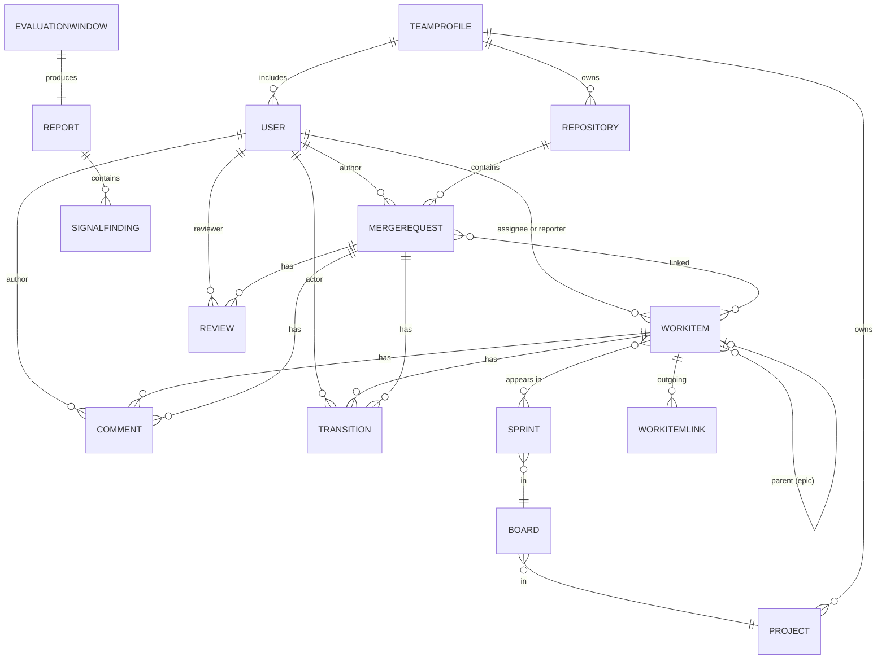

# EM Radar — Normalized Data Model

- **Status:** Draft v0.1
- **Date:** 2026-06-01
- **Owner:** Serdar Tas
- **Related:** [03-architecture-overview.md](./03-architecture-overview.md), [02-requirements.md](./02-requirements.md) §4.3, [07-connector-interface.md](./07-connector-interface.md)

## 1. Purpose

This document defines the canonical, source-agnostic data model that the EM Radar signal engine operates on.

Every connector must produce data in this shape. Every signal must consume data only in this shape. This is the load-bearing contract between connectors, the storage layer, and the signal engine.

If a signal needs information that this model does not expose, the answer is to extend this model, not to reach into raw Jira or GitLab payloads.

## 2. Design Principles

1. **Source-agnostic.** No Jira-only or GitLab-only fields in the canonical model. Anything source-specific lives in a `source_metadata` JSON blob carried alongside the entity.
2. **Stable internal IDs.** Every entity has an internal ID (opaque, stable, ours) and an external ID (the source's word). Internal IDs never change; external IDs are not assumed unique across sources.
3. **Append-only history.** Status changes are captured as `Transition` rows; comments are not edited in place. This lets signals like *repeated carry-over* and *sprint scope churn* be expressed declaratively without log diving.
4. **Conservative nullability.** A field is nullable only when a major source legitimately does not provide it. Signals must handle nulls explicitly.
5. **Timezone-aware UTC.** All timestamps are stored as UTC, ISO 8601, timezone-aware. Display conversion happens at the UI layer.
6. **No new PII.** We store user display names and source-side user IDs only. We do not enrich users with private attributes.

## 3. Entity Overview

> A fuller, attribute-level entity-relationship reference (including the application/config
> tables and the scoping/evaluation domain) is in [10-er-diagram.md](./10-er-diagram.md).

## 4. Common Field Patterns

Every entity carries the following common fields unless explicitly noted.

| Field | Type | Nullable | Description |
|---|---|---|---|
| `id` | UUID | no | Internal stable ID assigned by EM Radar. |
| `source` | string enum | no | Which connector produced this row. Values: `jira`, `gitlab`, `github`, `linear`, `demo`, plus any registered private source name. |
| `external_id` | string | no | The source's primary ID for this entity. Unique within `(source, entity_type)`. |
| `source_url` | string | yes | Direct URL to the entity in the source system, when available. |
| `source_metadata` | JSON | yes | Source-specific fields not promoted to the canonical model. Signals must not read this. |
| `fetched_at` | timestamp | no | When EM Radar last fetched this row. |
| `created_at` | timestamp | yes | When the entity was created in the source system. |
| `updated_at` | timestamp | yes | When the entity was last updated in the source system. |

## 5. Entities

### 5.1 User

A person referenced by other entities (assignee, reporter, author, reviewer, commenter, actor).

| Field | Type | Nullable | Description |
|---|---|---|---|
| `id` | UUID | no | Internal stable ID. |
| `source` | string | no | Source system. |
| `external_id` | string | no | Source's user ID. |
| `display_name` | string | no | Human-readable name shown in the source. |
| `email` | string | yes | If provided by the source and the token has permission. |
| `username` | string | yes | Source-side handle when distinct from display name. |
| `is_bot` | boolean | no | True if the source identifies the account as a bot or service account. Default `false`. |

Invariants:
- `(source, external_id)` is unique.
- A user from `jira` and a user from `gitlab` with the same email are two distinct User rows. Cross-source identity is resolved at the team profile layer, not here.

### 5.2 Project

A grouping unit in a source system (a Jira project, a GitLab top-level group, a GitHub repo group).

| Field | Type | Nullable | Description |
|---|---|---|---|
| `id`, `source`, `external_id`, ... | (common) | | |
| `key` | string | no | Short identifier (e.g. `ABC` for Jira project, `engineering` for a GitLab group). |
| `name` | string | no | Human-readable name. |

### 5.3 Board

A planning board within a project (Jira board, GitLab milestone board, etc.). Optional. Some sources have no concept of boards (use a synthetic one).

| Field | Type | Nullable | Description |
|---|---|---|---|
| (common) | | | |
| `project_id` | UUID | no | FK to Project. |
| `name` | string | no | Board name. |
| `type` | enum | yes | `scrum`, `kanban`, `other`. |

### 5.4 Sprint

A time-boxed iteration of work, as defined by the source.

| Field | Type | Nullable | Description |
|---|---|---|---|
| (common) | | | |
| `board_id` | UUID | no | FK to Board. |
| `name` | string | no | Sprint name. |
| `state` | enum | no | `future`, `active`, `closed`. |
| `start_date` | timestamp | yes | Planned start. |
| `end_date` | timestamp | yes | Planned end. |
| `complete_date` | timestamp | yes | Actual close date if closed. |
| `goal` | string | yes | Sprint goal text. |

### 5.5 WorkItem

A normalized representation of an item from a planning or ticketing system (Jira story/task/bug/epic, GitHub issue, Linear issue).

| Field | Type | Nullable | Description |
|---|---|---|---|
| (common) | | | |
| `project_id` | UUID | no | FK to Project. |
| `key` | string | no | Human-readable key (e.g. `ABC-123`). |
| `type` | enum | no | See §6.1 WorkItemType. |
| `title` | string | no | Summary. |
| `description` | text | yes | Long-form description (Markdown or HTML, normalized to text). |
| `status` | string | no | Raw status name from the source. |
| `status_category` | enum | no | See §6.2 StatusCategory. |
| `assignee_id` | UUID | yes | FK to User. |
| `reporter_id` | UUID | yes | FK to User. |
| `labels` | string[] | no | Flat list of label strings. Default `[]`. |
| `components` | string[] | no | Flat list. Default `[]`. |
| `parent_id` | UUID | yes | FK to WorkItem (epic link for stories, parent task, etc.). |
| `story_points` | number | yes | Story points if provided. |
| `acceptance_criteria` | text | yes | Extracted by field mapping (see §8). |
| `is_blocked` | boolean | no | Derived from the configured blocked-status or blocked-label rule. Default `false`. |
| `resolved_at` | timestamp | yes | When moved to a terminal status. |
| `due_date` | timestamp | yes | Due date if set. |
| `sprint_ids` | UUID[] | no | All sprints this item has ever appeared in (historical). Default `[]`. |
| `current_sprint_id` | UUID | yes | Sprint this item is currently in, if any. |

Invariants:
- `parent_id` cannot reference self.
- If `type = epic`, `parent_id` should be null in MVP (no nested epics).
- `current_sprint_id`, when set, must be present in `sprint_ids`.
- `resolved_at` is set if and only if `status_category = done`.

### 5.6 WorkItemLink

An edge representing relationships beyond parent/child (e.g. blocks, depends-on, duplicates).

| Field | Type | Nullable | Description |
|---|---|---|---|
| `id` | UUID | no | |
| `source_workitem_id` | UUID | no | |
| `target_workitem_id` | UUID | no | |
| `link_type` | enum | no | `blocks`, `is_blocked_by`, `relates_to`, `duplicates`, `is_duplicated_by`. |

Asymmetric link types must always be paired in storage as canonical (`blocks` + `is_blocked_by`).

### 5.7 Repository

A source-controlled code repository.

| Field | Type | Nullable | Description |
|---|---|---|---|
| (common) | | | |
| `name` | string | no | Repo name. |
| `full_path` | string | no | Group/namespace + name (e.g. `engineering/em-radar`). |
| `default_branch` | string | no | Usually `main`. |
| `is_archived` | boolean | no | Default `false`. |

### 5.8 MergeRequest

A normalized representation of a code-change request (GitLab MR, GitHub PR, Bitbucket PR).

| Field | Type | Nullable | Description |
|---|---|---|---|
| (common) | | | |
| `repository_id` | UUID | no | FK to Repository. |
| `iid` | integer | no | Repo-scoped sequential number (e.g. `!42`, `#42`). |
| `title` | string | no | |
| `description` | text | yes | |
| `state` | enum | no | See §6.3 MergeRequestState. |
| `is_draft` | boolean | no | Default `false`. |
| `author_id` | UUID | no | FK to User. |
| `target_branch` | string | no | |
| `source_branch` | string | no | |
| `created_at` | timestamp | no | Override of common: not nullable. |
| `updated_at` | timestamp | no | Override of common: not nullable. |
| `merged_at` | timestamp | yes | |
| `closed_at` | timestamp | yes | |
| `changed_files_count` | integer | yes | |
| `additions` | integer | yes | Lines added. |
| `deletions` | integer | yes | Lines deleted. |
| `pipeline_status` | enum | yes | See §6.4 PipelineStatus. |
| `pipeline_updated_at` | timestamp | yes | Used by *failing pipeline too long*. |
| `approval_count` | integer | no | Count of distinct approvers at current point. Default `0`. |
| `comment_count` | integer | no | Count of non-system comments. Default `0`. |
| `linked_workitem_keys` | string[] | no | Extracted keys (e.g. `["ABC-123"]`). Default `[]`. See §8.2. |
| `linked_workitem_ids` | UUID[] | no | Resolved FKs to WorkItem. Default `[]`. |

Invariants:
- `state = merged` requires `merged_at` set.
- `state = closed` requires `closed_at` set.
- `merged_at` and `closed_at` are mutually exclusive.

### 5.9 Review

A reviewer's activity on a MergeRequest. One Review row per (MR, reviewer, decision) event.

| Field | Type | Nullable | Description |
|---|---|---|---|
| `id` | UUID | no | |
| `mergerequest_id` | UUID | no | FK to MergeRequest. |
| `reviewer_id` | UUID | no | FK to User. |
| `decision` | enum | no | `approved`, `changes_requested`, `commented`, `dismissed`, `requested` (i.e. assigned-as-reviewer with no action yet). |
| `submitted_at` | timestamp | yes | Null for `requested` rows that have not acted. |

Notes:
- A user who approves, then unapproves, produces two Review rows. The signal engine cares about ordering.
- `requested` rows exist so signals can detect "reviewer assigned but no response".

### 5.10 Comment

A comment on a WorkItem or a MergeRequest.

| Field | Type | Nullable | Description |
|---|---|---|---|
| `id` | UUID | no | |
| `source` | string | no | |
| `external_id` | string | no | |
| `entity_type` | enum | no | `workitem` or `mergerequest`. |
| `entity_id` | UUID | no | FK to the parent entity. |
| `author_id` | UUID | no | FK to User. |
| `body` | text | yes | Comment text, normalized. |
| `created_at` | timestamp | no | |
| `updated_at` | timestamp | yes | |
| `is_system` | boolean | no | True for status-change auto-comments. Excluded from `comment_count` aggregates. |

### 5.11 Transition

A status-change event on a WorkItem or MergeRequest. Append-only.

| Field | Type | Nullable | Description |
|---|---|---|---|
| `id` | UUID | no | |
| `entity_type` | enum | no | `workitem` or `mergerequest`. |
| `entity_id` | UUID | no | FK. |
| `from_status` | string | yes | Null for the initial state. |
| `to_status` | string | no | |
| `from_status_category` | enum | yes | |
| `to_status_category` | enum | no | |
| `actor_id` | UUID | yes | FK to User. Null if the source reports a system actor. |
| `occurred_at` | timestamp | no | |

Used directly by *repeated carry-over*, *sprint scope churn*, and *blocked without recent update*.

### 5.12 TeamProfile

A user-defined grouping that scopes a report. Created locally in EM Radar; not pulled from a source.

| Field | Type | Nullable | Description |
|---|---|---|---|
| `id` | UUID | no | |
| `name` | string | no | |
| `description` | text | yes | |
| `connection_ids` | UUID[] | no | Source connections this team draws from. Default `[]`. |
| `project_ids` | UUID[] | no | Projects included in the team's scope. |
| `board_ids` | UUID[] | no | Boards included in the team's scope (drives sprint selection). Default `[]`. |
| `repository_ids` | UUID[] | no | Repositories included in the team's scope. |
| `working_mode` | enum | no | `scrum` or `kanban`. See §6.7. Derived from the selected board, user-confirmable. Default `scrum`. |
| `sprint_length_days` | integer | yes | Inferred sprint cadence (scrum only); null for kanban. |
| `member_user_keys` | string[] | no | Optional list of `source:external_id` strings to identify team members across sources. |
| `created_at` | timestamp | no | |
| `updated_at` | timestamp | no | |

A `TeamProfile` is first-class and created during onboarding (one or more per install). It is
the scope a report runs against, and its `working_mode` sets the report's default evaluation
window (sprint vs date range) — see [09-functional-flows §5–§6](./09-functional-flows.md#5-flow-c--team-scope--working-mode-detection).

### 5.13 EvaluationWindow

The scope a signal evaluation runs against.

| Field | Type | Nullable | Description |
|---|---|---|---|
| `id` | UUID | no | |
| `window_type` | enum | no | `sprint` or `date_range`. |
| `sprint_id` | UUID | yes | Required when `window_type = sprint`. |
| `start` | timestamp | yes | Required when `window_type = date_range`. |
| `end` | timestamp | yes | Required when `window_type = date_range`. |
| `team_profile_id` | UUID | no | The team this window applies to. |

### 5.14 SignalFinding

A specific result produced by a signal.

| Field | Type | Nullable | Description |
|---|---|---|---|
| `id` | UUID | no | |
| `report_id` | UUID | no | FK to Report. |
| `signal_id` | string | no | Stable ID from the signal catalog (e.g. `stale-in-progress-work-item`). |
| `signal_name` | string | no | Human-readable name at evaluation time. |
| `severity` | enum | no | See §6.5. |
| `confidence` | enum | no | See §6.6. |
| `entity_type` | enum | no | `workitem`, `mergerequest`, `sprint`, or `repository`. |
| `entity_id` | UUID | no | FK. |
| `title` | string | no | One-line headline (e.g. "ABC-123 stale for 9 days"). |
| `reason` | text | no | Plain-English explanation. |
| `recommendation` | text | yes | Suggested action. |
| `evidence` | JSON | no | Structured evidence (thresholds used, observed values, related entity IDs). |
| `source_link` | string | yes | URL to the source entity. |
| `created_at` | timestamp | no | |

Invariants:
- `(report_id, signal_id, entity_type, entity_id)` is unique within a report.

### 5.15 Report

The output of evaluating signals against an EvaluationWindow.

| Field | Type | Nullable | Description |
|---|---|---|---|
| `id` | UUID | no | |
| `evaluation_window_id` | UUID | no | FK. |
| `signal_pack_snapshot` | JSON | no | The exact signal pack configuration used (for reproducibility). |
| `status` | enum | no | `pending`, `running`, `succeeded`, `failed`. |
| `started_at` | timestamp | no | |
| `finished_at` | timestamp | yes | |
| `error` | text | yes | Populated if `status = failed`. |
| `findings_count_by_severity` | JSON | no | `{ "info": n, "warning": n, "critical": n }`. |

## 6. Enums and Controlled Vocabularies

### 6.1 WorkItemType
`epic`, `story`, `task`, `bug`, `subtask`, `spike`, `other`. Source-specific types are mapped at the connector layer.

### 6.2 StatusCategory
`todo`, `in_progress`, `done`, `blocked`. Connectors must map every raw source status to exactly one category.

### 6.3 MergeRequestState
`open`, `draft`, `merged`, `closed`.

### 6.4 PipelineStatus
`success`, `failed`, `running`, `canceled`, `skipped`, `none`. `none` means there is no pipeline associated.

### 6.5 Severity
`info`, `warning`, `critical`. Signals declare a default; users may override per signal in their pack.

### 6.6 Confidence
`high`, `medium`, `low`. Reflects how sure the signal is about its finding. MVP deterministic signals are almost always `high`; this field exists so later LLM-assisted signals have a place to express uncertainty.

### 6.7 WorkingMode
`scrum`, `kanban`. A team's working mode, derived from the selected Jira board (`Board.type`) and recent sprint cadence, confirmable by the user. Scrum teams default to a sprint evaluation window; kanban teams default to a date-range window. Sprint-only signals are skipped for kanban/date-range runs (see [09-functional-flows §10](./09-functional-flows.md#10-how-working-mode-shapes-signals-no-per-team-config)).

## 7. Identity, Linking, and Cross-Source Resolution

- **Within a source:** `(source, external_id)` is the natural key. Internal UUIDs are assigned on first fetch and never reused.
- **Across sources (MR ↔ WorkItem):** matched by extracting work-item keys from MR title, description, and source branch using the configured key pattern (default `[A-Z]+-\d+`). Multiple keys may match; all are stored in `linked_workitem_keys`. Resolved IDs are stored in `linked_workitem_ids` when a matching WorkItem exists.
- **Across sources (User ↔ User):** intentionally not auto-resolved in MVP. A team profile may carry a list of `source:external_id` strings to declare "these are the same person", but the signal engine does not infer this.

## 8. Field Mapping (Source → Canonical)

Each connector ships with a default mapping and exposes a configurable mapping for fields that vary across deployments. Mappings are stored separately from the data model.

### 8.1 Jira → WorkItem (defaults)

| Canonical | Jira |
|---|---|
| `key` | issue key |
| `type` | issue type name → mapped via §6.1 |
| `status` | status name |
| `status_category` | status category id → `todo` / `in_progress` / `done`, plus blocked rule (see below) |
| `assignee_id` | `fields.assignee` |
| `reporter_id` | `fields.reporter` |
| `parent_id` | `fields.parent.id` or epic-link custom field |
| `story_points` | configurable custom field (commonly `customfield_10016`) |
| `acceptance_criteria` | configurable custom field or `### Acceptance Criteria` heading parse |
| `is_blocked` | configured rule: either label match (`blocked`) or status flag |

### 8.2 GitLab → MergeRequest (defaults)

| Canonical | GitLab |
|---|---|
| `iid` | `iid` |
| `state` | `state` → `open` / `merged` / `closed`; `draft` derived from `work_in_progress` or `[Draft]` prefix |
| `approval_count` | distinct `user_id` from approvals API |
| `linked_workitem_keys` | regex extraction from title, description, and source branch using configured pattern |
| `pipeline_status` | `head_pipeline.status` → mapped via §6.4 |
| `pipeline_updated_at` | `head_pipeline.updated_at` |

### 8.3 GitHub → MergeRequest (Later)

Documented when the GitHub connector lands (Phase 3).

## 9. Versioning and Evolution

- The canonical model has a single integer version, exposed in the storage layer as `schema_version`.
- Adding a nullable field is a minor compatible change. No version bump.
- Adding a required field, changing a field's type, or removing a field is a breaking change. Version bumps and a migration are required.
- Connectors declare the minimum model version they require so EM Radar can refuse to load incompatible connectors cleanly.
- Migrations are managed with Alembic. Every breaking change ships with both the migration and a documented manual fallback for users on the prior version.

## 10. What This Model Deliberately Does NOT Include

- **Per-engineer productivity metrics.** Out of scope per [vision §15](./01-vision-and-scope.md) and the non-goal "no developer scoring".
- **Time tracking.** Out of scope for MVP.
- **Custom user-defined entities.** The model is fixed at MVP. Custom signals will run against the entities above only.
- **Vendor-specific deep payloads.** Anything beyond what is promoted to the canonical model lives in `source_metadata` and is invisible to signals.
