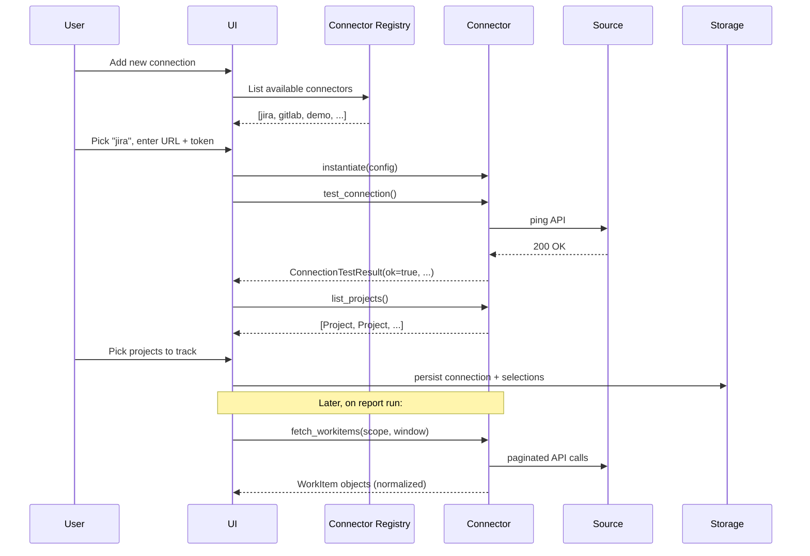

# EM Radar — Connector Interface Specification

- **Status:** Draft v0.1
- **Date:** 2026-06-01
- **Owner:** Serdar Tas
- **Related:** [05-data-model.md](./05-data-model.md), [03-architecture-overview.md](./03-architecture-overview.md) §6, [02-requirements.md](./02-requirements.md) §4.2

## 1. Purpose

This document specifies the contract a connector must implement to integrate a source system (Jira, GitLab, GitHub, Linear, a private system) with EM Radar.

The contract has two goals:

1. Let **the open-core team** build Jira and GitLab connectors in parallel without stepping on each other.
2. Let **a company** ship a private connector for an internal system without forking EM Radar.

If you can implement the interfaces in §6 and register your connector per §11, EM Radar can use your source.

## 2. Concepts

- **Connector.** A Python package that exposes one class implementing `ConnectorBase`, plus one or more provider mixins.
- **Provider.** A capability mixin (e.g. `WorkItemProvider`, `MergeRequestProvider`). A connector declares which providers it implements.
- **Capability.** A boolean flag describing what the connector can do. Used by the engine to decide which signals to evaluate for which sources.
- **Normalization.** Transformation from source-specific payloads into [canonical models](./05-data-model.md). All normalization happens inside the connector.

## 3. Connector Lifecycle



The lifecycle methods are:

1. **`instantiate(config)`**: construct with a validated config dict.
2. **`test_connection()`**: verify the credentials work; return a structured result.
3. **`describe_capabilities()`**: declare what the connector supports.
4. **`list_*`**: enumerate sources of work (projects, boards, repositories).
5. **`fetch_*`**: pull data for the chosen scope and evaluation window.
6. **`close()`**: release HTTP clients and any open resources.

## 4. Configuration

Every connector declares a JSON Schema for its configuration. EM Radar uses the schema to render the connection form in the UI.

```python
class ConnectorBase:
    config_schema: ClassVar[dict]   # JSON Schema, Pydantic-generated
```

Example for Jira:

```python
class JiraConnectorConfig(BaseModel):
    base_url: HttpUrl
    token: SecretStr
    auth_email: str | None = None    # Jira Cloud uses email + token; Server uses PAT only
    verify_tls: bool = True
```

Rules:
- Any field of type `SecretStr` (Pydantic) or matching the names `token`, `password`, `api_key`, `secret`, `authorization` is treated as a credential. It is masked in the UI, never logged, and never exported.
- The config object is validated before `instantiate` is called.

## 5. Capabilities

A connector declares its capabilities so the engine can:

- Decide which signals make sense to evaluate against a given source.
- Skip signals whose required data is unavailable.
- Surface a "what this connector can do" view in the UI.

```python
@dataclass(frozen=True)
class Capabilities:
    provides_workitems: bool = False
    provides_sprints: bool = False
    provides_mergerequests: bool = False
    provides_repositories: bool = False
    provides_reviews: bool = False
    provides_comments: bool = False
    provides_transitions: bool = False
    supports_incremental_fetch: bool = False     # if false, every fetch is a full re-fetch within scope
    supports_pagination_cursor: bool = False     # if false, pagination is offset/page-based
    max_window_days: int | None = None           # source-imposed limit (None = no limit)
```

The Jira connector returns capabilities like:
`provides_workitems=True, provides_sprints=True, provides_transitions=True, supports_incremental_fetch=True`.

The GitLab connector returns:
`provides_mergerequests=True, provides_repositories=True, provides_reviews=True, supports_incremental_fetch=True`.

## 6. Required Interfaces

### 6.1 `ConnectorBase` (always required)

```python
class ConnectorBase(Protocol):
    name: ClassVar[str]              # short stable identifier, e.g. "jira"
    display_name: ClassVar[str]      # shown in UI, e.g. "Jira (Cloud or Server)"
    config_schema: ClassVar[dict]    # JSON Schema for the config
    min_model_version: ClassVar[int] # minimum canonical-model version this connector requires

    def __init__(self, config: dict) -> None: ...
    async def test_connection(self) -> ConnectionTestResult: ...
    def describe_capabilities(self) -> Capabilities: ...
    async def close(self) -> None: ...
```

`ConnectionTestResult`:

```python
@dataclass
class ConnectionTestResult:
    ok: bool
    detail: str               # human-readable, suitable for UI
    user_display_name: str | None = None   # name of the authenticated user
    permissions: list[str] = field(default_factory=list)
```

### 6.2 `WorkItemProvider` (Jira, Linear, GitHub Issues)

```python
class WorkItemProvider(Protocol):
    async def list_projects(self) -> list[Project]: ...
    async def list_boards(self, project_id: str) -> list[Board]: ...
    async def list_sprints(self, board_id: str) -> list[Sprint]: ...

    async def fetch_workitems(
        self,
        scope: WorkItemScope,
        window: EvaluationWindow,
    ) -> AsyncIterator[WorkItem]: ...
```

`WorkItemScope`:

```python
@dataclass
class WorkItemScope:
    project_external_ids: list[str]
    board_external_ids: list[str] = field(default_factory=list)
    workitem_types: list[WorkItemType] | None = None   # None means all
```

`fetch_workitems` is an async iterator so connectors can stream large pages without buffering. Every yielded `WorkItem` must already be normalized per [data model §5.5](./05-data-model.md#55-workitem).

### 6.3 `MergeRequestProvider` (GitLab, GitHub PRs, Bitbucket)

```python
class MergeRequestProvider(Protocol):
    async def list_repositories(self) -> list[Repository]: ...

    async def fetch_mergerequests(
        self,
        scope: MergeRequestScope,
        window: EvaluationWindow,
    ) -> AsyncIterator[MergeRequest]: ...
```

`MergeRequestScope`:

```python
@dataclass
class MergeRequestScope:
    repository_external_ids: list[str]
    include_drafts: bool = True
    include_closed_unmerged: bool = False
```

### 6.4 `ReviewProvider` (optional)

```python
class ReviewProvider(Protocol):
    async def fetch_reviews(
        self,
        mergerequest_external_ids: list[str],
    ) -> AsyncIterator[Review]: ...
```

Connectors that include review data inline with merge requests may set `provides_reviews=True` and emit reviews via this method (called by the engine after merge requests are fetched).

### 6.5 `TransitionProvider` (optional)

```python
class TransitionProvider(Protocol):
    async def fetch_transitions(
        self,
        entity_type: Literal["workitem", "mergerequest"],
        entity_external_ids: list[str],
    ) -> AsyncIterator[Transition]: ...
```

Required for signals that depend on history (`sprint-scope-churn`, `repeated-carry-over`). Connectors without transition history should set `provides_transitions=False`; affected signals will be skipped with a clear note in the report.

### 6.6 `CommentProvider` (optional)

```python
class CommentProvider(Protocol):
    async def fetch_comments(
        self,
        entity_type: Literal["workitem", "mergerequest"],
        entity_external_ids: list[str],
    ) -> AsyncIterator[Comment]: ...
```

## 7. Authentication

- Tokens are passed in via `config` (validated through `config_schema`).
- The connector is responsible for building the appropriate `Authorization` header.
- Connectors **must not** log the token or any header containing it. The default `httpx` client configured by EM Radar redacts `Authorization` from logs; use it if at all possible.
- For Jira Cloud, basic auth with `auth_email:token` is supported.
- For GitLab, the `PRIVATE-TOKEN` header is used.
- OAuth flows are out of MVP scope.

## 8. Pagination

Two pagination shapes are supported. Connectors declare via `supports_pagination_cursor`.

- **Cursor-based** (preferred): the connector internally walks pages until exhausted, yielding entities as it goes.
- **Offset/page-based**: same external behavior; the connector loops over pages.

Either way, the **engine** does not paginate. It awaits the async iterator until it stops.

Pagination concerns the connector hides from the engine:

- Page size selection (sensible default per source).
- Inter-page rate limiting.
- Resumption on transient failures.

## 9. Rate Limiting and Retries

- The connector must respect source rate limits. The standard practice is exponential backoff on `429` and `5xx`, with a maximum of 5 retries.
- The connector must surface a clear, structured error (`SourceRateLimitedError`) if it exhausts retries. The engine catches this and reports it as a partial-data condition in the report, not as a crash.
- Long fetches must yield items as they arrive so the UI can show progress.

## 10. Errors

Connectors raise typed errors from a shared hierarchy:

```python
class ConnectorError(Exception): ...
class ConnectorAuthError(ConnectorError): ...           # 401/403
class ConnectorNotFoundError(ConnectorError): ...       # 404
class ConnectorRateLimitedError(ConnectorError): ...    # 429 exhausted retries
class ConnectorTransientError(ConnectorError): ...      # 5xx exhausted retries
class ConnectorConfigError(ConnectorError): ...         # bad config that slipped past schema validation
class ConnectorDataError(ConnectorError): ...           # source returned a payload we cannot normalize
```

The engine catches these, never `Exception`. A connector that lets a raw `httpx.HTTPError` escape is a bug.

## 11. Registration and Discovery

Connectors register via Python entry points in `pyproject.toml`:

```toml
[project.entry-points."em_radar.connectors"]
jira = "em_radar_connector_jira:JiraConnector"
gitlab = "em_radar_connector_gitlab:GitLabConnector"
demo = "em_radar_connector_demo:DemoConnector"
```

At startup, EM Radar discovers all registered connectors via `importlib.metadata.entry_points`. A private connector published as a private Python package and `uv pip install`-ed into the runtime is discovered the same way as a bundled one.

## 12. Demo Connector

A `demo` connector ships with EM Radar. It:

- Implements every provider interface.
- Generates a deterministic, opinionated fake company's data (projects, sprints, work items, MRs, transitions, comments).
- Is the basis for all unit tests of the signal engine.
- Lets a brand-new user click "Try with demo data" and see a report in 30 seconds, no Jira/GitLab credentials required.

## 13. Testing a Connector

Every connector must ship with:

1. **Unit tests** for normalization, using static fixtures of source payloads.
2. **Contract tests** asserting the connector satisfies its declared interfaces. The open-source repo ships a `pytest` plugin that runs the contract test suite against any connector.
3. **Optional integration tests** requiring real credentials. These are not run in CI by default. They live behind an env-var gate.

The contract test suite checks, among other things:

- `test_connection()` returns a structured result for both success and a deliberately bad config.
- `describe_capabilities()` matches the methods actually implemented.
- Pagination handles empty pages, partial pages, and full pages.
- Errors are raised from the declared error hierarchy, never raw `httpx` exceptions.
- Normalized entities satisfy the canonical model's invariants.

## 14. Private Connector Pattern (Outside the OSS Repo)

A company that needs a connector for an internal system should:

1. Create a private Python package (e.g. `acme-em-radar-connector`).
2. Implement `ConnectorBase` and the required providers.
3. Declare an entry point under `em_radar.connectors`.
4. Distribute it via the company's internal package index.
5. Add `uv add acme-em-radar-connector` to the deployment recipe.

The open-source EM Radar binary does not need to be modified, recompiled, or rebuilt. The connector is discovered at startup.

This is the same mechanism used by bundled connectors. Bundled vs. private is a packaging detail, not a runtime difference.

## 15. What a Connector Must NOT Do

- Implement signal logic. Signals live in the open-source core.
- Persist data to its own database. Storage is the engine's job.
- Reach across canonical entities to make decisions. The connector emits normalized data; the engine joins.
- Mutate the source system. MVP is read-only ([REQ-NF-011](./02-requirements.md)).
- Log credentials or full request/response bodies that may contain credentials.
- Phone home, send telemetry, or contact any service other than the configured source.
- Bypass the canonical model by smuggling source-specific fields into top-level columns. Source-specific data goes in `source_metadata`.

## 16. Versioning

A connector declares `min_model_version`. EM Radar refuses to load a connector whose `min_model_version` exceeds the running engine's model version, with a clear message telling the user to upgrade EM Radar.

A connector should follow semver:
- **Patch** for bug fixes in normalization.
- **Minor** for new providers added, new capabilities declared.
- **Major** if its config schema breaks in a way that requires user re-entry.
