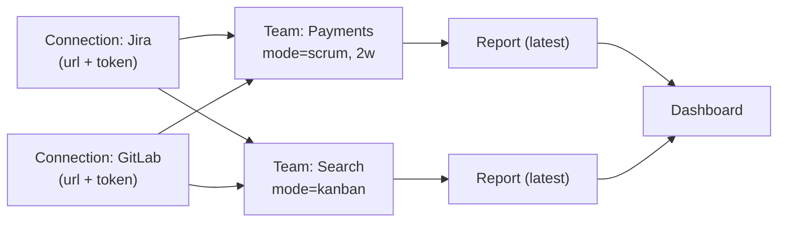
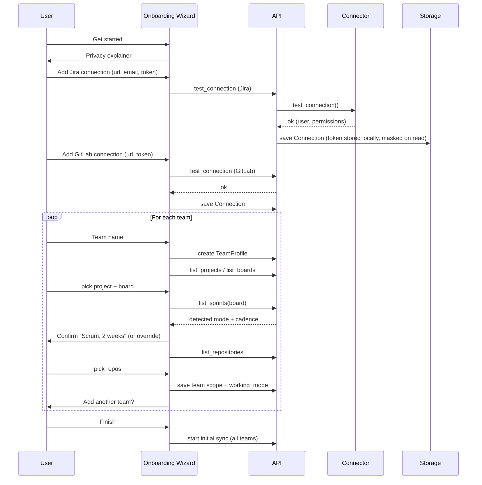
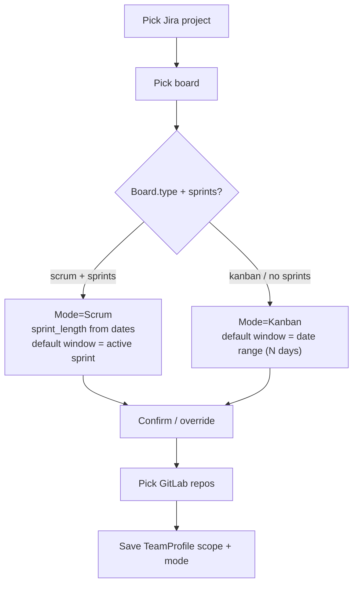
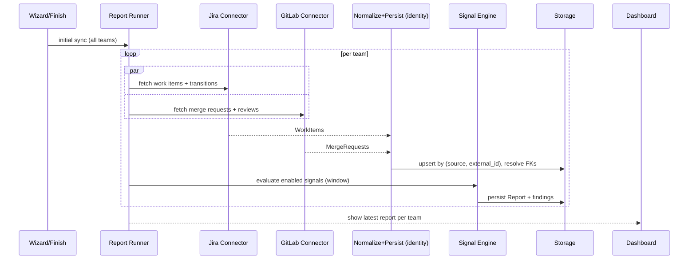

# EM Radar — Functional Flows

- **Status:** Draft v0.1
- **Date:** 2026-06-07
- **Owner:** Serdar Tas
- **Related:** [01-vision-and-scope.md](./01-vision-and-scope.md) §6, [02-requirements.md](./02-requirements.md) §4, [03-architecture-overview.md](./03-architecture-overview.md) §18, [05-data-model.md](./05-data-model.md), [07-connector-interface.md](./07-connector-interface.md)

## 1. Purpose

This document describes the **end-to-end functional flows** an Engineering Manager (EM) walks
through when using EM Radar: first-run onboarding, connecting sources, scoping teams, the
initial data sync, the dashboard, running reports, and reconfiguration.

The earlier specs define *what the system is made of* (entities, connectors, signals). This
document defines *how a person moves through it*. Where a flow implies a change to an existing
spec, that change is called out in §12 (Model & Backlog Impact) rather than silently assumed.

The four shaping decisions behind these flows:

1. **Connection once, scope per team.** Source credentials are entered once as a reusable
   *Connection*; each *Team* selects its own scope (board/projects/repos) from existing
   connections.
2. **Latest-report landing dashboard.** After setup, the landing page shows each team's most
   recent report (severity counts + top risks) with a refresh action. It reuses the report
   view; it is not a separate analytics product.
3. **Working mode derived from Jira, confirmed by the user.** Scrum vs Kanban and sprint
   length are inferred from the selected Jira board and recent sprints, then shown for
   confirm/override.
4. **First-class multi-team in MVP.** Onboarding supports creating several named teams; teams
   are manageable after setup.

MVP source support is **Jira + GitLab**. GitHub and others are later phases
([requirements REQ-F-015/016](./02-requirements.md#req-f-015--github-connector)); the flows
below are written source-agnostically so adding a source does not reshape them.

---

## 2. Actors and Key Entities

| Concept | What it is | Storage | Notes |
|---|---|---|---|
| **EM (user)** | The single local user. | — | No multi-user/auth in MVP. |
| **Connection** | One source instance + credentials (Jira Cloud URL + token; GitLab URL + token). | `SourceConnection` ([architecture §8.1](./03-architecture-overview.md#81-stored-data), M2-03) | Reusable across teams. Created once per source instance. |
| **Team** | A named unit of work the EM manages. Carries scope + working mode. | `TeamProfile` ([data model §5.12](./05-data-model.md#512-teamprofile)) | First-class; multiple per install. See §12 for fields added by this doc. |
| **Scope** | The slice of a connection a team uses: Jira project + board, GitLab repositories. | On `TeamProfile` (`project_ids`, `board_ids`, `repository_ids`) | A team may draw from more than one connection. |
| **Working mode** | `scrum` or `kanban`, plus sprint length for scrum. | On `TeamProfile` (`working_mode`, `sprint_length_days`) | Derived from the board; user-confirmable. |
| **Report** | Result of evaluating signals for a team over a window. | `Report` + `SignalFinding` ([data model §5.14–5.15](./05-data-model.md#514-signalfinding)) | One per run; persisted; viewable offline. |
| **Dashboard** | Landing view: latest report per team. | Derived (reads latest `Report` per team) | Not a new stored entity. |

**Relationship shape:**

---

## 3. Flow A — First-run Onboarding Wizard

**Goal.** Take a fresh user from an empty install to a populated dashboard, guiding them through
connections and one or more teams.

**Entry condition.** No `TeamProfile` rows exist (first run). The wizard is the expanded form
of the Setup page ([requirements REQ-F-002](./02-requirements.md#req-f-002--local-web-ui)).

**Steps.**

1. **Welcome & privacy.** Plain-language local-first explainer (data/tokens/reports stay local,
   no telemetry, read-only access). One "Get started" CTA. Also offers **"Try with demo data"**
   to skip straight to a demo report ([roadmap M1](./08-mvp-roadmap.md#m1--canonical-model--demo-path-end-to-end)).
2. **Add ticketing connection (Jira).** See [Flow B](#4-flow-b--connection-setup--token-guidance).
   Required to run work-item signals.
3. **Add code connection (GitLab).** See [Flow B](#4-flow-b--connection-setup--token-guidance).
   Optional but recommended; merge-request signals need it.
4. **Create team.** Ask for a **team name**. Creates a `TeamProfile`.
5. **Scope the team.** See [Flow C](#5-flow-c--team-scope--working-mode-detection): pick a Jira
   project + board, confirm the detected working mode/cadence, pick GitLab repositories.
6. **Add another team?** If **yes**, return to step 4. Existing connections are **reused** (no
   token re-entry); the user may add a new connection if a team lives on a different instance.
   If **no**, continue.
7. **Finish → initial sync.** See [Flow D](#6-flow-d--initial-sync--dashboard).

**Resumability.** Each completed step is persisted immediately, so closing the browser
mid-wizard does not lose entered connections/teams; reopening resumes at the first incomplete
step.

---

## 4. Flow B — Connection Setup & Token Guidance

**Goal.** Establish a verified, reusable connection to a source, with safe token handling.

**Steps.**

1. **Pick a source.** The form is rendered from the connector's `config_schema`
   ([connector spec §4](./07-connector-interface.md#4-configuration)) via the connector
   registry (`GET /api/connectors`). Secret fields render as write-only password inputs.
2. **Inline access guidance.** Per source, link to the minimum read-only scopes and how to
   create the token ([requirements REQ-NF-011](./02-requirements.md#req-nf-011--read-only-source-access),
   M7-09). Jira Cloud uses email + API token; GitLab uses a `PRIVATE-TOKEN`.
3. **Test connection.** Calls `test_connection()`; on success show the authenticated user and
   detected permissions ([connector spec §6.1](./07-connector-interface.md#61-connectorbase-always-required)).
   On failure, show a structured, token-free error
   ([requirements REQ-NF-070](./02-requirements.md#req-nf-070--graceful-source-failure)).
4. **Save.** Token stored locally; **masked on every read** (`****` + last 4), never logged,
   never exported ([ADR-0006](./ADRs/0006-token-storage.md),
   [requirements REQ-NF-003](./02-requirements.md#req-nf-003--credential-safety)).

**Reuse.** When scoping a later team, existing connections are offered first; the user only
adds a new connection if the team uses a different instance.

**Error handling.** `ConnectorAuthError` → "credentials rejected"; `ConnectorNotFoundError` →
"URL/instance not found"; `ConnectorRateLimitedError`/`ConnectorTransientError` → "source busy,
retry" — all from the typed hierarchy ([connector spec §10](./07-connector-interface.md#10-errors)),
never a stack trace, never the token.

---

## 5. Flow C — Team Scope & Working-Mode Detection

**Goal.** Bind a team to a concrete slice of its connections and establish how it works, with
minimal questions.

**Steps.**

1. **Pick Jira project + board.** From `list_projects` then `list_boards(project)`
   ([connector spec §6.2](./07-connector-interface.md#62-workitemprovider-jira-linear-github-issues)).
2. **Detect working mode + cadence.** On board selection, read `Board.type`
   (`scrum`/`kanban`/`other`, [data model §5.3](./05-data-model.md#53-board)) and the most
   recent closed/active sprints via `list_sprints` to infer **sprint length** from
   `start_date`/`end_date` medians.
   - **Scrum detected:** show "Scrum · sprint length 2 weeks" pre-filled; default report window
     = **active sprint**.
   - **Kanban detected (or no sprints):** show "Kanban"; default report window = **date range**
     (last `N` days, default 14).
   - User can **confirm or override** either field.
3. **Pick GitLab repositories.** Multiselect from `list_repositories`
   ([connector spec §6.3](./07-connector-interface.md#63-mergerequestprovider-gitlab-github-prs-bitbucket)).
4. **Field mappings (defaults, advanced deferred).** Default Jira mappings are applied
   silently ([data model §8.1](./05-data-model.md#81-jira--workitem-defaults)); an "advanced
   field mapping" affordance exists but is optional (M3-05).
5. **Persist** the scope + working mode on the `TeamProfile`.

**Why mode matters downstream.** Working mode sets the team's **default report window**, which
in turn determines **which signals can fire**: sprint-only signals
(`repeated-carry-over`, `sprint-scope-churn`) require a sprint window and are **skipped with a
note** for date-range/Kanban runs, mirroring connector-capability skipping
([connector spec §6.5](./07-connector-interface.md#65-transitionprovider-optional)). No
per-team signal configuration is required for this — see §10.

---

## 6. Flow D — Initial Sync & Dashboard

**Goal.** On finishing setup, fetch each team's data and present something useful with no
further clicks.

**Steps.**

1. **Build the window per team.** Scrum → `EvaluationWindow(window_type=sprint, sprint_id=active)`;
   Kanban → `EvaluationWindow(window_type=date_range, start=now-N days, end=now)`
   ([data model §5.13](./05-data-model.md#513-evaluationwindow)), with `team_profile_id` set.
   `EvaluationContext.now` = the report's start time (determinism rule,
   [README §4](./backlog/README.md#4-conventions-paths-names-ports)).
2. **Fetch concurrently.** Jira (work items + transitions) and GitLab (merge requests +
   reviews) fetched in parallel ([architecture §18.2](./03-architecture-overview.md#182-report-generation-flow)).
   Progress is shown per source; **partial-source failure is non-fatal** and surfaced as a
   partial-data note ([requirements REQ-NF-070](./02-requirements.md#req-nf-070--graceful-source-failure)).
3. **Normalize, persist, resolve identity.** Normalized entities are upserted by
   `(source, external_id)` to stable internal IDs, and cross-entity links (assignee, parent,
   sprint, MR↔WorkItem) are resolved ([data model §2, §7](./05-data-model.md#2-design-principles)).
4. **Evaluate enabled signals** and persist a `Report` per team with
   `findings_count_by_severity`.
5. **Land on the dashboard.**

**Dashboard contents (MVP).** A card per team:

- team name + working mode,
- severity counts (`critical` / `warning` / `info`),
- the top N highest-severity findings (the "top risks" slice),
- **Refresh** (re-run the team's default window) and **Open report** (full sectioned view),
- last-run timestamp and any partial-data warning.

The dashboard is **derived**: it reads the latest `Report` per team. No new time-series storage
in MVP (trends/charts are a later phase, §11).

---

## 7. Flow E — Generate / Refresh a Report

**Goal.** Produce a fresh report on demand, from the dashboard or the Report Runner.

**Triggers.**

- **Dashboard → Refresh:** re-runs the team's **default** window (active sprint or rolling
  date range).
- **Report Runner:** choose team, then window — a **sprint picker** (Scrum) or **date-range
  picker** (Kanban, or either mode when the EM wants an ad-hoc range)
  ([requirements REQ-F-050/051](./02-requirements.md#req-f-050--sprint-report)).

**Output.** The sectioned report ([requirements REQ-F-052](./02-requirements.md#req-f-052--report-sections)):
summary, top risks, planning hygiene, delivery flow, sprint health, merge request flow, source
linking, detailed findings, suggested actions — severity-ordered, every finding linking back to
its source item, exportable to Markdown ([requirements REQ-F-053](./02-requirements.md#req-f-053--markdown-export)).

Each run **persists a new `Report`**; the latest becomes the team's dashboard card. Past reports
remain viewable (Flow H).

---

## 8. Flow F — Reconfiguration

The wizard is first-run; these are the steady-state management flows.

| Action | Where | Effect |
|---|---|---|
| **Add a team** | Teams page → "Add team" | Re-enters the team loop (Flow A steps 4–6), reusing connections. |
| **Edit a team's scope/mode** | Team detail | Change board/repos or override working mode; next run uses it. |
| **Add / edit / re-test a connection** | Connections page | Update URL/token; `test_connection` re-verifies; token stays masked. |
| **Re-sync** | Dashboard/Team | Refetch + re-evaluate without changing config. |
| **Delete a connection** | Connections page | Removes the connection **and its cached normalized data**; warns about teams that depend on it ([requirements REQ-NF-004](./02-requirements.md#req-nf-004--data-deletion), M7-05). |
| **Delete a team** | Teams page | Removes the team, its scope, and its reports. |
| **Delete cached data / report history** | Settings / Privacy | Clears caches/reports; documented manual volume deletion for a full wipe. |

All destructive actions require confirmation and never touch the source systems (read-only,
[requirements REQ-NF-011](./02-requirements.md#req-nf-011--read-only-source-access)).

---

## 9. Flow G — Signal Configuration & Import/Export

Steady-state, largely as already specified (M2-13):

- View all 13 catalog signals, enable/disable, edit thresholds and severity, reset per-signal
  or all ([requirements REQ-F-031/041](./02-requirements.md#req-f-031--configurable-built-in-signals)).
- Export current config as a self-contained YAML pack (no credentials); import with a validated
  diff preview before applying ([signal spec §13–§14](./06-signal-yaml-spec.md#13-export-behavior)).

**Scoping to teams.** Signal *applicability* per team is achieved through signal-pack **scope
filters** (`project_keys`, `repository_paths`, etc., [signal spec §7.4](./06-signal-yaml-spec.md#74-scope-optional-object))
combined with the team's window, **not** through separate per-team signal configs in MVP. See
§10.

---

## 10. How Working Mode Shapes Signals (no per-team config)

A single global signal pack serves all teams. Per-team behavior emerges from two mechanisms:

1. **Window-gating.** Sprint-only signals require a sprint window. A Kanban/date-range run skips
   them and records a one-line note in the report ("skipped: requires a sprint window"). This
   reuses the capability-skip pattern from
   [connector spec §6.5](./07-connector-interface.md#65-transitionprovider-optional).
2. **Scope filters.** A team only evaluates entities within its scope (its projects/repos),
   because the report runs against that team's `TeamProfile` scope and the pack's scope filters.

This keeps MVP simple: no per-team threshold matrix. Per-team signal overrides are noted as a
later enhancement (§11).

---

## 11. Deferred / Out of Scope for These Flows

- **Aggregated analytics dashboard** (cross-team rollups, trends, charts, time-series storage).
  MVP dashboard is latest-report-per-team only.
- **Scheduled / background auto-refresh.** MVP sync is triggered by finishing setup or by an
  explicit refresh; cron-style refresh is later
  ([roadmap §5](./08-mvp-roadmap.md#5-out-of-mvp-backlog-phase-2)).
- **GitHub and other sources** in onboarding (Phase 3).
- **Per-team signal configuration / packs.** MVP uses one global pack + scope + window-gating.
- **Multi-source-per-capability teams** (e.g. two Jira instances feeding one team) beyond the
  basic "team may draw from more than one connection" already covered.
- **Cross-source user identity resolution** beyond `member_user_keys`
  ([data model §7](./05-data-model.md#7-identity-linking-and-cross-source-resolution)).

---

## 12. Model & Backlog Impact

These flows imply the following deltas to the existing specs and backlog. They are recorded here
for traceability; applying them is a separate step.

**Data model ([05-data-model.md](./05-data-model.md)).**

- Extend `TeamProfile` (§5.12) with: `board_ids: UUID[]` (scope), `working_mode: enum
  {scrum, kanban}`, `sprint_length_days: int | null`, and explicit links to the connections it
  uses (or derive via the contained project/repo ids).
- Confirm `TeamProfile` is first-class and created during onboarding (supersedes the earlier
  "auto-seeded Default team" simplification).

**UI pages ([architecture §12.1](./03-architecture-overview.md#121-mvp-ui-pages), backlog M2).**

- Add a **Dashboard** landing page (latest report per team).
- Add a **Teams** management page.
- The **Setup** page becomes the **Onboarding wizard** (Flow A).

**Backlog (GitHub Issues).**

- The pending change set already adds **M2-17** (normalized persistence + identity resolution),
  **M2-18** (team profiles), **M2-19** (connector registry + `GET /api/connectors`). These flows
  expand **M2-18** from "default team" to "multi-team onboarding wizard + Teams page", and add a
  **Dashboard** ticket.
- Report-runner tickets (M1-08, M3-06, M4-06, M6-02) pass a real `team_profile_id` and derive
  the default window from the team's working mode.
- Engine gains **window-gating** of sprint-only signals (M5 area).

**Requirements ([02-requirements.md](./02-requirements.md)).**

- The added report sections (sprint health, source linking) align with the 9-section report
  decision; onboarding/dashboard behavior should be reflected in REQ-F-002 and the MVP
  acceptance checklist.
