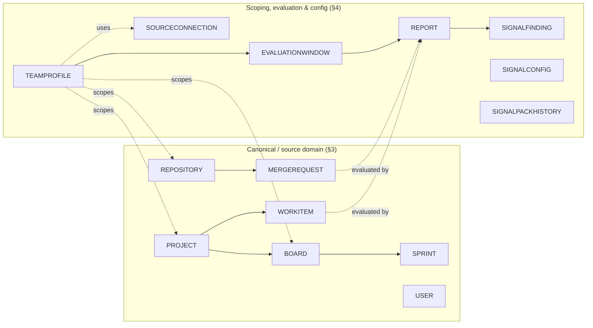
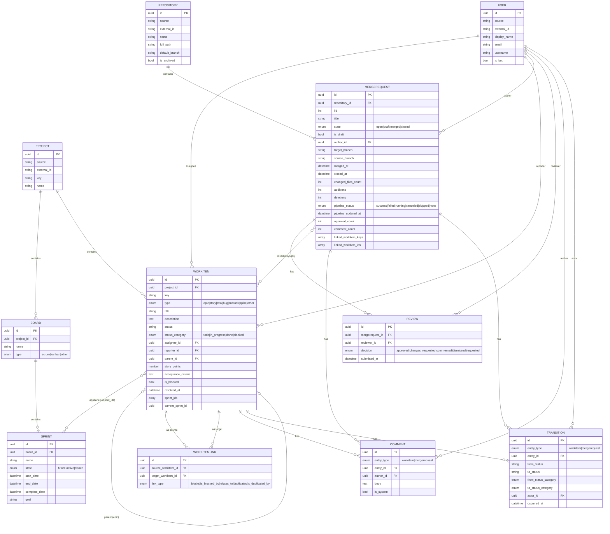
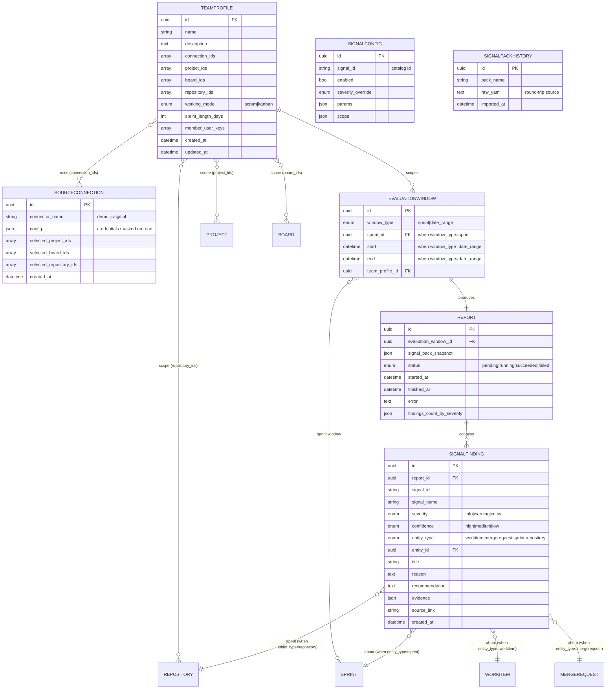

# EM Radar — Entity-Relationship Diagram

- **Status:** Draft v0.1
- **Date:** 2026-06-07
- **Owner:** Serdar Tas
- **Related:** [05-data-model.md](./05-data-model.md) (authoritative field-level spec), [09-functional-flows.md](./09-functional-flows.md), [03-architecture-overview.md](./03-architecture-overview.md)

## 1. Purpose

This document is a **visual reference** for the EM Radar schema. The authoritative,
field-by-field definitions (types, nullability, invariants, enums) live in
[05-data-model.md](./05-data-model.md); this file shows the entities and how they relate, at
attribute altitude, so the shape is easy to grasp at a glance.

The schema splits into two domains that meet at `TeamProfile`:

1. **Canonical / source domain** — normalized data pulled from Jira/GitLab (§3).
2. **Scoping, evaluation & configuration domain** — teams, connections, windows, reports,
   findings, and local config (§4).

Attribute lists below are a meaningful subset (keys + load-bearing fields). For the complete
column set of any entity, see the matching section in [05-data-model.md §5](./05-data-model.md#5-entities).

**Cardinality legend (Mermaid crow's-foot):**

| Notation | Meaning |
|---|---|
| `\|\|--\|\|` | exactly one ↔ exactly one |
| `\|\|--o{` | one ↔ zero or many |
| `}o--\|\|` | zero or many ↔ exactly one |
| `}o--o\|` | zero or many ↔ zero or one |
| `}o--o{` | many ↔ many (in MVP, materialized as UUID-array fields, not join tables) |

> **Note on array relationships.** Several links (`sprint_ids`, `project_ids`, `board_ids`,
> `repository_ids`, `connection_ids`, `linked_workitem_ids`) are stored as **UUID arrays** on the
> owning row (SQLite JSON columns), not as separate join tables. They are drawn as many-to-many
> for clarity but carry no association entity in MVP.

---

## 2. High-Level Map

---

## 3. Canonical / Source Domain

Normalized entities produced by connectors. Every row carries the common fields from
[data model §4](./05-data-model.md#4-common-field-patterns) (`id`, `source`, `external_id`,
`source_url`, `source_metadata`, `fetched_at`, `created_at`, `updated_at`); only distinguishing
fields are repeated below.

**Notes.**
- `COMMENT` and `TRANSITION` are **polymorphic** (`entity_type` + `entity_id`): a row belongs to
  either a `WorkItem` or a `MergeRequest`, never both.
- `WORKITEMLINK` is an edge with two FKs into `WORKITEM` (`source`/`target`); asymmetric link
  types are stored as canonical pairs ([data model §5.6](./05-data-model.md#56-workitemlink)).
- `MERGEREQUEST ↔ WORKITEM` linking is by extracted key (`linked_workitem_keys`) resolved to
  `linked_workitem_ids` when a matching item exists ([data model §7](./05-data-model.md#7-identity-linking-and-cross-source-resolution)).

---

## 4. Scoping, Evaluation & Configuration Domain

Teams scope what a report sees; a report is the result of evaluating signals over an
evaluation window. `SourceConnection`, `SignalConfig`, and `SignalPackHistory` are local
application tables ([backlog M2-03/M2-18/M2-19](./backlog/M2-storage-config-ui.md)), not pulled
from a source.

**Notes.**
- `TeamProfile.working_mode` drives the default window type: **scrum → sprint**, **kanban →
  date_range**. Sprint-only signals are skipped on date-range runs (window-gating,
  [09-functional-flows §10](./09-functional-flows.md#10-how-working-mode-shapes-signals-no-per-team-config)).
- `EvaluationWindow` requires `sprint_id` **xor** (`start`,`end`) per `window_type`
  ([data model §5.13](./05-data-model.md#513-evaluationwindow)).
- `SignalFinding.entity_id` is **polymorphic** over `entity_type` (work item, MR, sprint, or
  repository); the four "about" relationships above are mutually exclusive per row.
- `SourceConnection.config` holds credentials at rest (SQLite, masked on read,
  [ADR-0006](./ADRs/0006-token-storage.md)); it is the only place tokens live and is never
  exported.
- `Dashboard` is **not** an entity — it is derived by reading the latest `Report` per
  `TeamProfile` ([09-functional-flows §6](./09-functional-flows.md#6-flow-d--initial-sync--dashboard)).

---

## 5. Identity & Persistence

Internal `id` UUIDs are **stable across fetches**, keyed by `(source, external_id)`; the
persistence/identity layer ([backlog M2-17](./backlog/M2-storage-config-ui.md)) upserts on each
fetch and resolves cross-entity references (assignee, parent, sprint membership, MR↔WorkItem)
from external ids to internal UUIDs. See [data model §2 and §7](./05-data-model.md#2-design-principles).

Cross-**source** user identity (the same human in Jira and GitLab) is **not** auto-resolved in
MVP; a `TeamProfile.member_user_keys` list may declare it, but the engine does not infer it.
